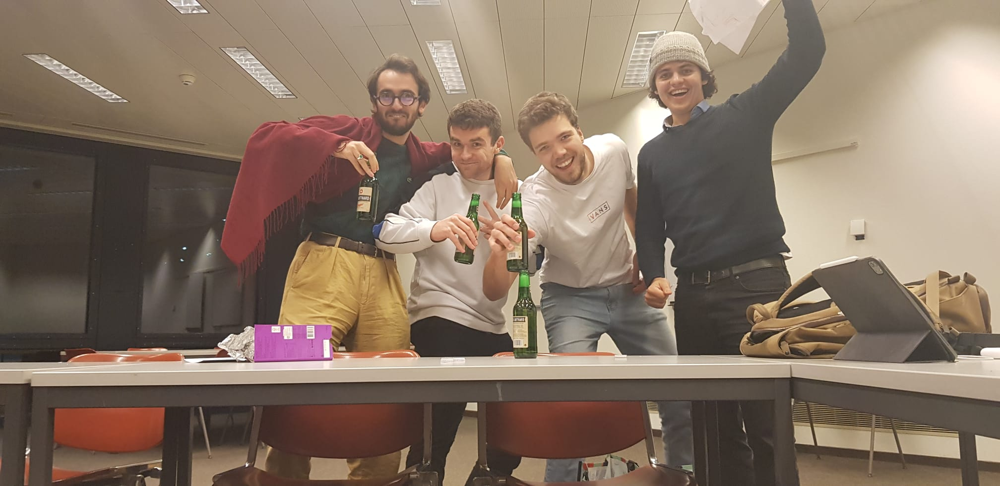
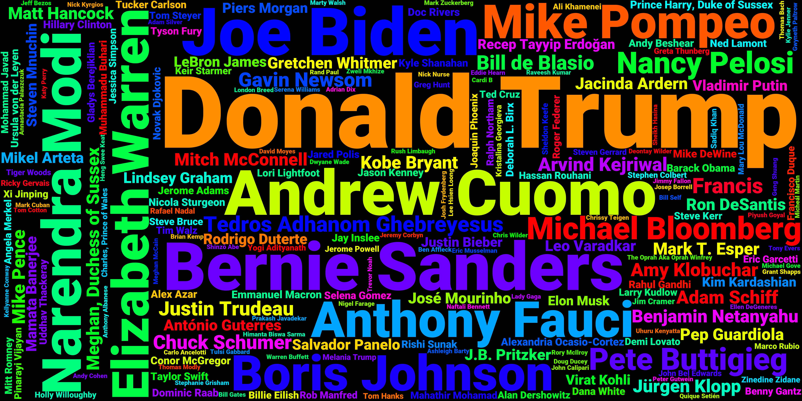

# M3 submission <!-- omit in toc -->

- __Link to the website__: <a href="https://quotebankers.github.io/">quotebankers.github.io/</a>
- __The following UI__ is also part of the final submission (please go through it first): [quotebankers.netlify.app/](https://quotebankers.netlify.app/)
- __Linktree__ for the UI implementation: [linktr.ee/QuoteBankers](https://linktr.ee/QuoteBankers)
- __Supporting notebooks__ (to be graded): 
  - How we preprocessed the Quotebank dataset: [Preprocessing.ipynb](Preprocessing.ipynb)
  - How we performed clustering on speakers: [Clustering.ipynb](clustering.ipynb)
  - How we investigated the speakers attributes: [Who.ipynb](who.ipynb)
  - How we performed topic classification: [What.ipynb](what.ipynb)
  - How we performed emotion analysis: [How.ipynb](how.ipynb)
  - How we trained a model to output the speaker's score in the UI: [n_quotes_prediction.ipynb](n_quotes_prediction.ipynb)

__Contributions__:  
Everyone worked on the website.
- Benjamin: Dataset pre-processing, supervised learning for score prediction, website structuring
- Thomas: Emotion classification, web app interface, API, 
- Matheus: Pre-processing, Clustering part, Who pipeline, plots
- Eliott: What pipeline (topic classification), plots, setting up the website

  
   
  <em>The QuoteBankers 1 hour before the deadline</em>

# Who has a voice in the media? <!-- omit in toc --> 

What kind of people has a voice in the media? What do they need to talk about and how do they need to express themselves? A datastory that aims to draw the typical profile of individuals quoted in the media.

  
   
  <em>Most frequent speakers in 2020 quotations (random sample size: 1'000'0000)</em>

## Table of Contents <!-- omit in toc -->

- [Abstract](#abstract)
- [Research questions](#research-questions)
- [Additional datasets](#additional-datasets)
- [Methods](#methods)
- [Timeline](#timeline)
- [Milestones](#milestones)
- [Questions for TAs](#questions-for-tas)
  

## Abstract
What a pleasure it is to be listened to… The ability to make your voice heard is a privilege that few can afford. Sometimes you can have the feeling that only the loudest are listened to.  
Starting from the 2015-2020 Quotebank dataset, which precisely gathers speaker-attributed quotations from various web domains, we will tackle the following question: who has a voice in the media? This project has the ambitious aim to identify key attributes that will make a speech quoted and spread out. First, by gathering insights about speakers, with the use of wikidata: gender, age, occupation, ethnicity, etc. Second, by considering the quotation in itself and extract the subjects tackled, as well as the sentiments associated with the speech. From our datastory, we will be able to understand why an individual is more quoted than another, and anyone will have the keys to maximize its odds to be quoted in a famous english-speaking media.

## Research questions
A list of research questions you would like to address during the project.
- What kind of people has a voice in the media? We will consider socio-economic characteristics such as occupation, gender, age, ethnicity, etc. This question is investigated in the notebook [initial_analysis.ipynb](initial_analysis.ipynb).
- What do they need to talk about (in order to be quoted)? More precisely, investigate the answer to this question as a function of speaker's profile (e.g. quotation topics for different occupation, gender etc.). This part will involve text classification and is tackled in the notebook [what.ipynb](what.ipynb).
- How do they need to say it? More precisely, investigate the emotion carried in the quotes, and determine if one emotion is more use than an other in the corpus. This part will evolve emotion classification and emotion analysis, and is tacklend in the notebook [find_emotions.ipynb](find_emotions.ipynb).
- How does the answer to the previous questions changed over time?

## Additional datasets
-  __Metadata about speakers__:   The metadata about the speakers provided in the course's Drive is used in the notebook [initial_analysis.ipynb](initial_analysis.ipynb) to get the attributes about the quoted speakers.
- __Language model for text classification and sentiment analysis__:   We will be using the following fine-tuned model, appropriate for the task of zero-shot text classification: DistilBERT base model uncased ([see there](https://huggingface.co/typeform/distilbert-base-uncased-mnli)). This model is fine-tuned on Multi-Genre Natural Language Inference (MNLI) dataset for the zero-shot classification task.

## Methods
* __Text classification__ for answering the "What ? ". More precisely, our project requires to be able to automatically find quotations' topics: for example among {politics, U.S., world, economy, business, sport, science, technology, culture}. The approach used is called "zero-shot text classification" and is described in the notebook [what.ipynb](what.ipynb).
* __Sentiment analysis__ for answering the "How ? ". This part tries to encapsulate *how* the message in the quote is conveyed, from an emotional perspective. The analysis of the emotion displayed in the quotes can take several forms, from sentiment analysis to emotion classification. Three different approaches were tried each on a 100 000 values sample of the 2020 cleaned quote dataset.
  -  First comes sentiment analysis, using the [VADER](http://comp.social.gatech.edu/papers/icwsm14.vader.hutto.pdf) sentiment analysis tool. Using it on the 2020 cleaned dataset, one can get a polarity and a compound value for each quote representing the sentiment of the quote, ranging from -1 to 1, -1 representing purely negative quote and 1 representing a positive quote. This method is easily scalable as the whole 100000 quote dataset was processed in less than 40 secondes, and yields good results. However, it does not have the accuracy of the following methods.
  -  Second comes emotion classification. Two different methods were tried, but only one was kept. The abandoned method was to leverage  a [Doc2Vec](https://radimrehurek.com/gensim/models/doc2vec.html) model to embed the quotes into a vector space, and then train a classifier using the [EmoBank](https://github.com/JULIELab/EmoBank) dataset to classify each quote into a 3- dimensional emotion model and have a finer model than the sentiment analysis method. However this method was dropped as it would have required too much time to train and assess the quality of the developed model, and it would not scale well with the bigger dataset.
  -  The kept emotion classification method is the zero-shot classification using the [Hugging-Face](https://huggingface.co/) framework that is also used  in the topic classification part of the project. This method is easily scalable as 100 000 quotes were classified in less than 10 minutes, and seem to yield acceptable results. The emotion categories chosen were angry, joy, sad, fear, calm and neutral, according to the [Russel model](https://www.sciencedirect.com/science/article/pii/009265667790037X) of emotion.

## Timeline
Here is the proposed timeline up until Milestone 3:
- 12 Nov: hand-in of Milestone 2 and Homework 2 released;
- 26 Nov: Homework 2 deadline;
- 3 Dec: the planned data analysis proposed in the Conclusions of [initial_analysis.ipynb](initial_analysis.ipynb) is finished;
- 5 Dec: a specific aspect is found and run through the "what" and "how" pipelines;
- 9 Dec: the merging of the "what" and the "how" with the rest of the data analysis is implemented on the final notebook;
- 10 Dec: start writing the datastory and the website where it will be hosted;
- 14 Dec: the datastory is finalized and hosted, final fine-tuning of README and final notebook is done;
- 17 Dec: Milestone 3 deadline.

## Milestones
Here are the milestones for Milestone 3:
- finalize planned data analysis proposed in the Conclusions of [initial_analysis.ipynb](initial_analysis.ipynb)
- find specific aspect of data to be studied for the datastory;
- run the networks to find the "what" and "how" of the quotes in the reduced dataset that is being analyzed for the datastory;
- merge the "what" and "how" in the final analysis;
- write the datastory and host it;
- update README.

## TODO (non-prioritized)
- [ ] Add background music to web-app (Thomas)
- [ ] Update image with all names (Eliott)
- [x] Remove weird arrow above section "Our team"
- [x] Add top 10 occupations accross all genders in point 3 under WHO 
- [x] Do new plot of quotations per speakers using updated frame with column 'label' with line instead of bar plot (Matheus)
- [ ] Change tab icon
- [x] Center occupations plot (Eliott)
- [ ] Add age + occupation to website (Benjamin)
- [ ] Add clustering to website (Matheus)
- [ ] Add button to link to web-app
- [ ] Remove plotly bar from plots
- [ ] reduce img size 
- [ ] change beginning text by "how to be ON the radar"
