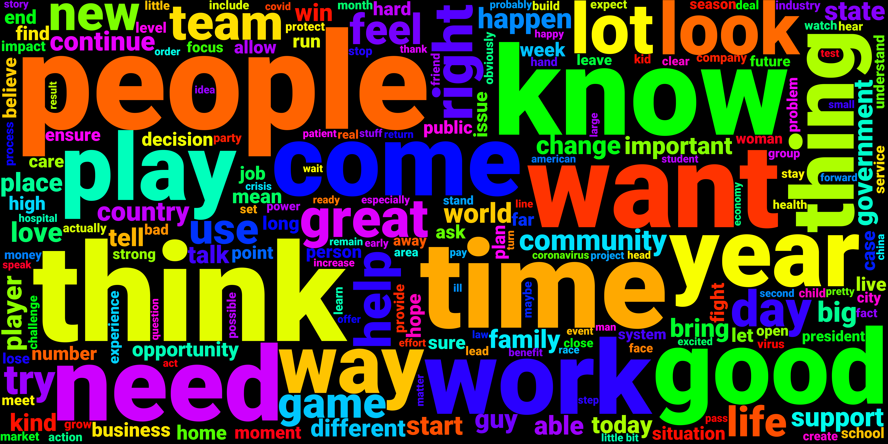

# Who has a voice in the media? <!-- omit in toc --> 
What kind of people has a voice in the media? What do they need to talk about and how do they need to express themselves? A datastory that aims to draw the typical profile of individuals quoted in the media.

    
  <em>Most frequent words in 2020 quotations (random sample size 10'000)</em>

## Table of Contents <!-- omit in toc -->
- [Abstract](#abstract)
- [Research questions](#research-questions)
- [Additional datasets](#additional-datasets)
- [Methods](#methods)
- [Timeline](#timeline)
- [Milestones](#milestones)
- [Questions for TAs](#questions-for-tas)

## Abstract
A 150 word description of the project idea and goals. What’s the motivation behind your project? What story would you like to tell, and why?

## Research questions
A list of research questions you would like to address during the project.
- What type of people has a voice in the media? E.g. gender, age, nationality, post, etc.
- What do they need to say?
- How do they need to say it?
- How does the answer to the previous questions changed over time?

## Additional datasets
List the additional dataset(s) you want to use (if any), and some ideas on how you expect to get, manage, process, and enrich it/them. Show us that you’ve read the docs and some examples, and that you have a clear idea on what to expect. Discuss data size and format if relevant. It is your responsibility to check that what you propose is feasible.

## Methods

## Timeline
- ...
- 12 Nov: homework 2 released
- 26 Nov: homework 2 deadline
- 12 Nov: milestone P2 deadline
- 17 Dec: milestone P3 deadline  

## Milestones
A list of internal milestones up until project Milestone 3.
- ...

## Questions for TAs
Add here any questions you have for us related to the proposed project.
